# Lab ARSW3

## Daniel Ricardo Ruge Gomez

## Parte I

### 1

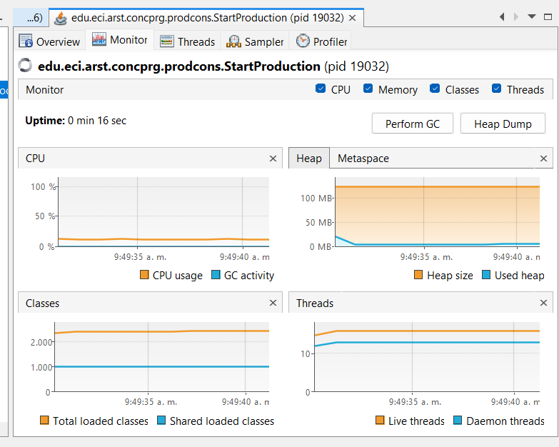

El consumo de CPU que se puede ver en la ejecución del programa es por la clase Consumer, ya que su método run contiene un ciclo infinito (while(true)) que constantemente revisa si la cola tiene elementos (queue.size() > 0), y cuando está vacía, el hilo sigue ejecutándose sin detenerse, generando algo que se conoce como busy waiting. Esto provoca un uso innecesario de CPU, mientras que la clase Producer no causa este problema porque incluye pausas con Thread.sleep(1000) entre cada producción.

### 2 

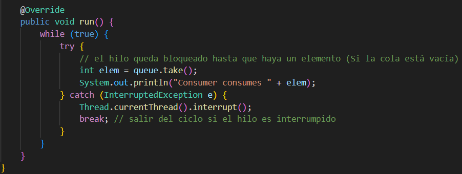

cambios: 

Cambié el tipo de Queue<Integer> a BlockingQueue<Integer> (tambien toco cambiarlo en StartProduction), porque esta interfaz tiene métodos bloqueantes, tambien reemplacé if (queue.size() > 0) { poll() } por queue.take(), que espera hasta que haya un elemento disponible y evita el consumo excesivo de CPU y finalmente puse un InterruptedException para permitir salir del bucle limpiamente si se interrumpe el hilo.

JVMachine ahora: 

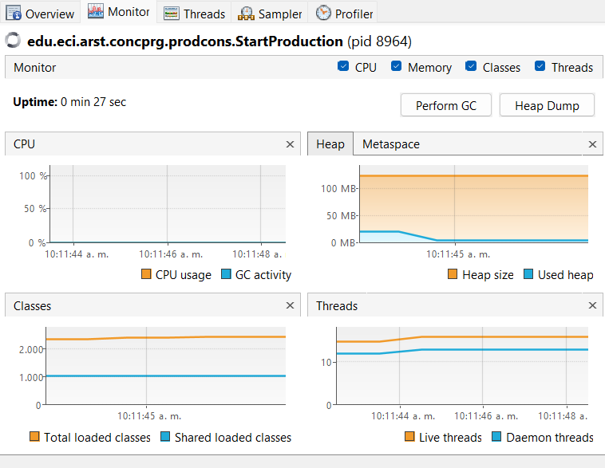

### 3

cambios:

El cambio principal fue ya reemplazar por completo el uso de Queue por BlockingQueue, de modo que el límite de stock no tenga que controlarse manualmente con la variable stockLimit, sino que queda garantizado por la propia cola bloqueante al definir su capacidad en el constructor (new ArrayBlockingQueue<>(stockLimit)). Con esto, el productor ya no necesita preguntar constantemente si hay espacio disponible, si no que simplemente usa put(), que lo bloquea cuando la cola está llena y libera el hilo cuando hay espacio, evitando el consumo innecesario de CPU y respetando automáticamente el límite de elementos en la cola.

prueba de que con un limte bajo no hay sobreconsumo : 

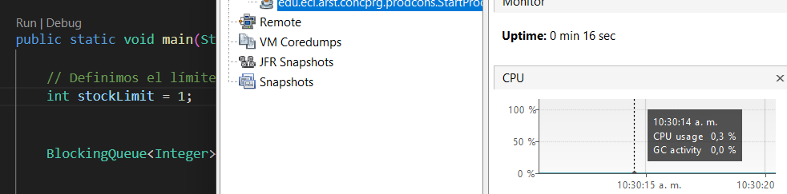

## Parte II

modifique el código para que los hilos dejen de procesar servidores en cuanto se alcanzan las cinco ocurrencias, en lugar de recorrer toda la lista completa. Para esto se agregó un control de concurrencia mediante AtomicInteger (como lo vimos en clase) para llevar el conteo global de ocurrencias y un stopFlag compartido (tipo AtomicBoolean) que indica cuándo detener la búsqueda. Ambos tipos atómicos garantizan que las operaciones del flag sean atómicas, visibles inmediatamente para todos los hilos y eviten condiciones de carrera en el acceso a estas variables.

## Parte III

### 1

El programa simula hilos llamados inmortales que pelean entre sí indefinidamente, restando y sumando salud. La interfaz permite crearlos y mostrarlos, pero aún no controla bien la ejecución: el botón de pausa solo calcula la salud total sin detenerlos, el de reanudar está vacío y el de detener no funciona. Además, la pelea no está sincronizada, lo que puede generar condiciones de carrera al modificar la salud de un mismo inmortal al mismo tiempo.

### 2 
 
dado que Cada inmortal arranca con 100 puntos de vida. Si tienemos N jugadores, la suma inicial de toda la vida es 100 × N,
ese debería ser el invariante ya que mientras nadie esté en medio de una pelea (un instante “congelado”), la sumatotal de la vida de todos los jugadores debería mantenerse siempre en 100 × N, porque cuando uno pierde puntos, el otro los gana en la misma cantidad.

### 3

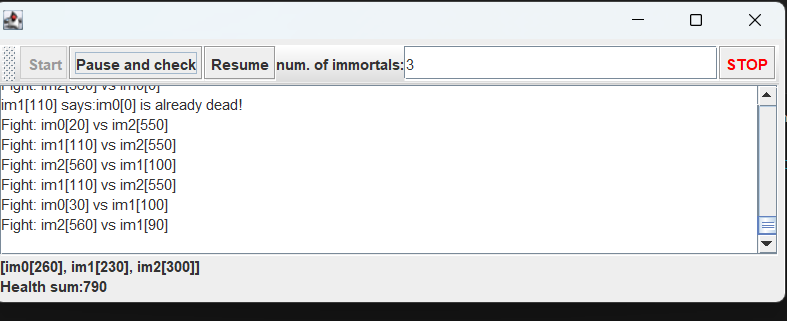

podemos ver que el invariante que propusimos no se cumple lo cual indica que seguramente hay problemas de sincronización en el acceso y actualización de la salud de los inmortales

### 4

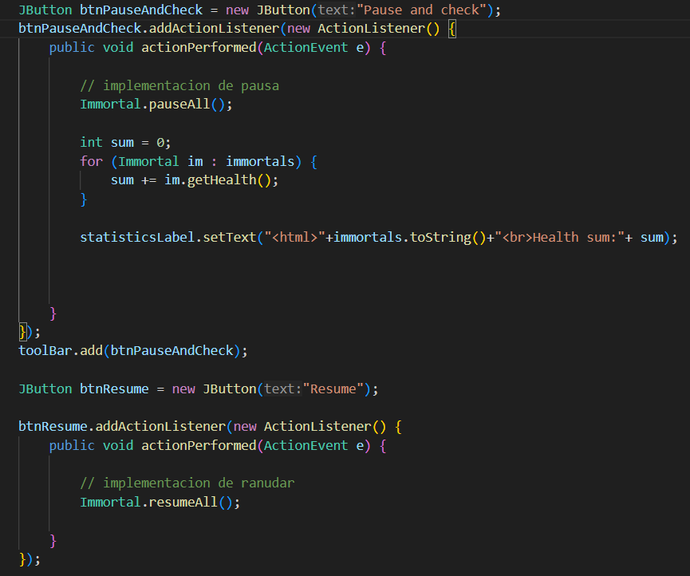

añadí las funciones pauseAll() y resumeAll() en la clase Immortal, usando una variable AtomicBoolean para coordinar la pausa de todos los hilos de forma segura. Luego, en la interfaz (ControlFrame),modifique los botones, el de “Pause and check” primero pausa todos los hilos antes de calcular y mostrar la suma de salud y el de “Resume” reanuda la ejecución de los hilos pausados. 

### 5

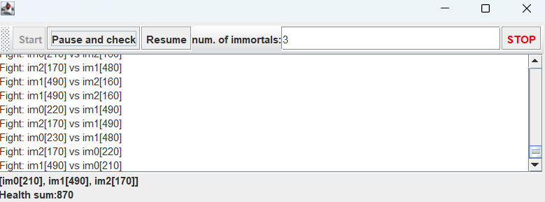

Sin embargo podemos ver que el invariante sigue sin cumplirse 

### 6

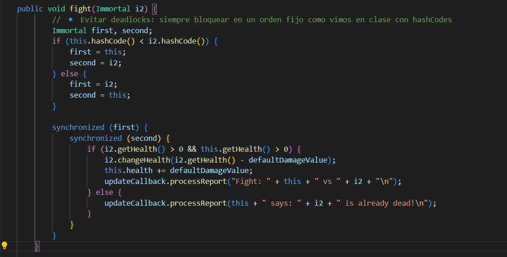

identifique que la region critica estaba en el metodo figth asi que apliqué el meotodo de locks sincronizados anidados en fight para proteger la transferencia de salud con un orden de bloqueo fijo usando hashCode() para evitar deadlocks 

### 7 y 8

dado que al momento de implementar los locks anidados fui cuidadoso y lo hice con un orden fijo no experimente problemas de deadlocks por lo que estos dos puntos me los "salte"

### 9

100 inmortales

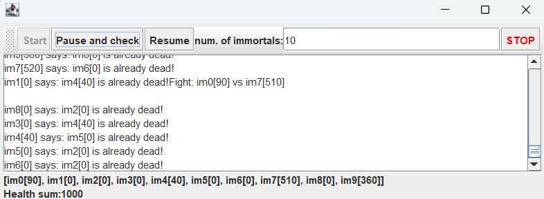

1000 inmortales

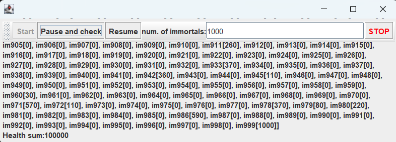

para 10000 inmortales mi computador directamente se apago pero en general podemos ver como el invariate se cumple sin problema en cada caso "grande"

### 10

Sí, eliminar inmortales muertos directamente de la lista mientras los demás hilos siguen accediendo a ella puede generar una condición de carrera, ya que un hilo podría estar iterando o eligiendo un oponente al mismo tiempo que otro elimina un elemento, causando errores de concurrencia o inconsistencias; para evitarlo se debe sincronizar el acceso a la lista global de inmortales o, como alternativa más sencilla, marcar a los inmortales como muertos y omitirlos en las peleas en lugar de eliminarlos físicamente de la lista.

implementacion:

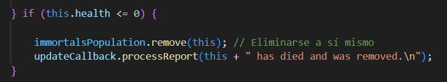

concecuencia con muchos inmortales:

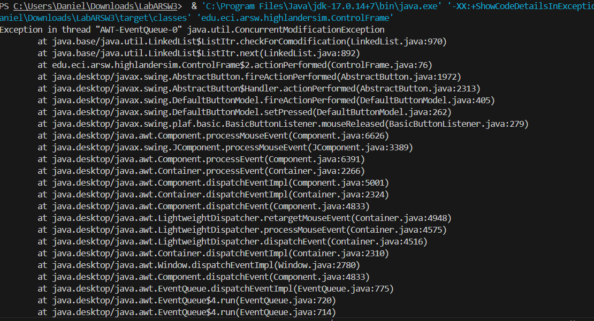

Al implementar la eliminación de inmortales durante la simulación se evidenció que, cuando hay una gran cantidad de hilos ejecutándose y accediendo a la misma lista compartida, se genera una ConcurrentModificationException. Esto ocurre porque mientras un hilo intenta recorrer la lista para verificar el estado de los inmortales, otro hilo la está modificando al eliminar elementos.

Arreglo:

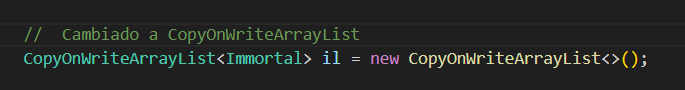

El cambio consistió en reemplazar la estructura ArrayList por una CopyOnWriteArrayList, lo que permitió que varios hilos accedieran y modificaran la lista de inmortales de manera concurrente sin necesidad de sincronización explícita. Esta clase maneja internamente las copias de la lista en cada modificación, evitando condiciones de carrera y eliminando el riesgo de ConcurrentModificationException