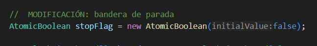

# Lab ARSW3

## Daniel Ricardo Ruge Gomez

## Parte I

#### 1

El consumo de CPU que se puede ver en la ejecución del programa es por la clase Consumer, ya que su método run contiene un ciclo infinito (while(true)) que constantemente revisa si la cola tiene elementos (queue.size() > 0), y cuando está vacía, el hilo sigue ejecutándose sin detenerse, generando algo que se conoce como busy waiting. Esto provoca un uso innecesario de CPU, mientras que la clase Producer no causa este problema porque incluye pausas con Thread.sleep(1000) entre cada producción.

### 2 

cambios: 

Cambié el tipo de Queue<Integer> a BlockingQueue<Integer> (tambien toco cambiarlo en StartProduction), porque esta interfaz tiene métodos bloqueantes, tambien reemplacé if (queue.size() > 0) { poll() } por queue.take(), que espera hasta que haya un elemento disponible y evita el consumo excesivo de CPU y finalmente puse un InterruptedException para permitir salir del bucle limpiamente si se interrumpe el hilo.

JVMachine ahora: 

### 3

cambios:

El cambio principal fue ya reemplazar por completo el uso de Queue por BlockingQueue, de modo que el límite de stock no tenga que controlarse manualmente con la variable stockLimit, sino que queda garantizado por la propia cola bloqueante al definir su capacidad en el constructor (new ArrayBlockingQueue<>(stockLimit)). Con esto, el productor ya no necesita preguntar constantemente si hay espacio disponible, si no que simplemente usa put(), que lo bloquea cuando la cola está llena y libera el hilo cuando hay espacio, evitando el consumo innecesario de CPU y respetando automáticamente el límite de elementos en la cola.

prueba de que con un limte bajo no hay sobreconsumo : 

## Parte II

 modifique el código para que los hilos dejen de procesar servidores en cuanto se alcanzan las cinco ocurrencias, en lugar de recorrer toda la lista completa. Para esto se agregó un control de concurrencia mediante AtomicInteger (como lo vimos en clase) para llevar el conteo global de ocurrencias y un stopFlag compartido (tipo AtomicBoolean) que indica cuándo detener la búsqueda. Ambos tipos atómicos garantizan que las operaciones del flag sean atómicas, visibles inmediatamente para todos los hilos y eviten condiciones de carrera en el acceso a estas variables.